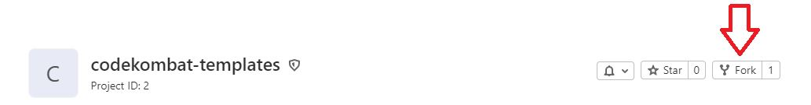
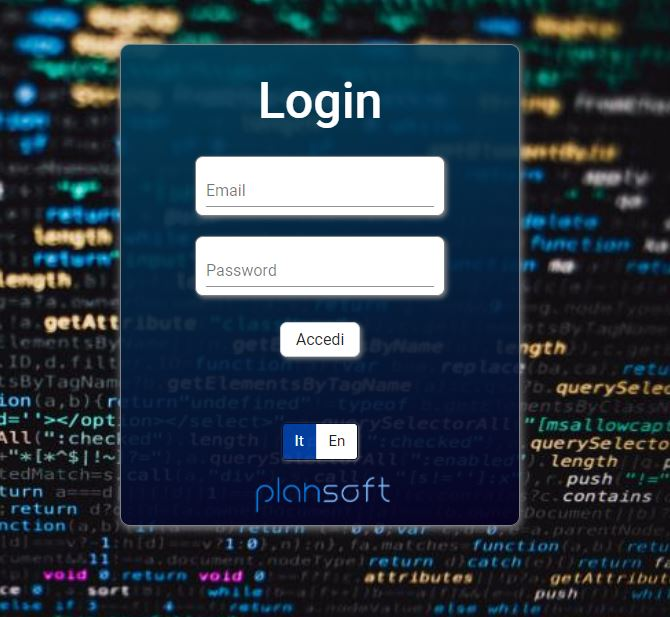
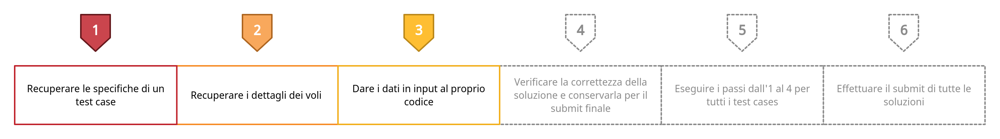
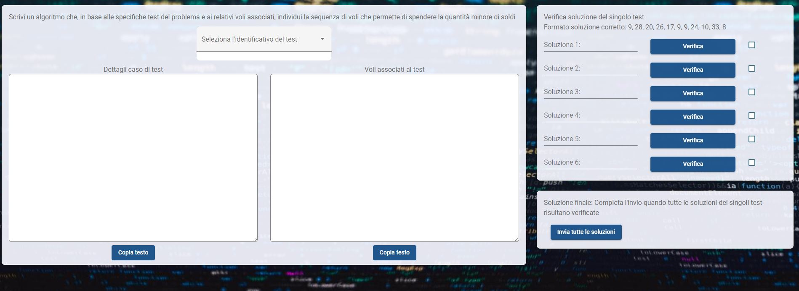
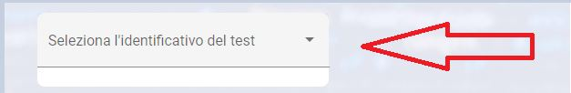
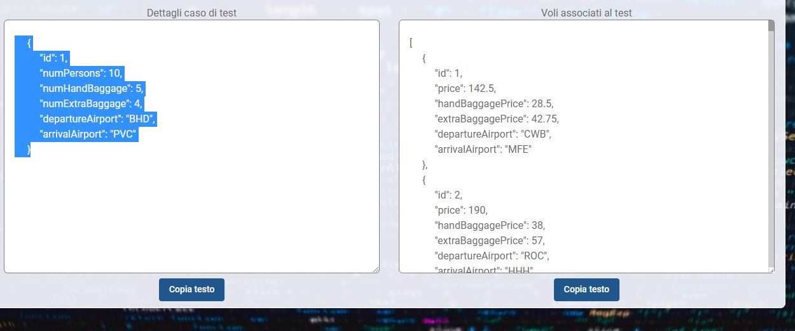
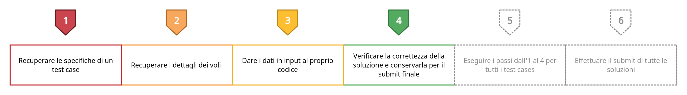
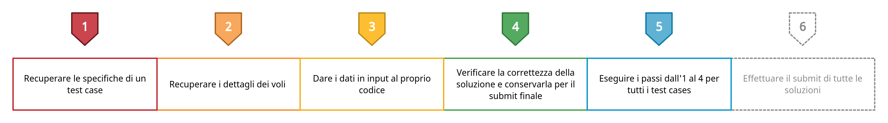
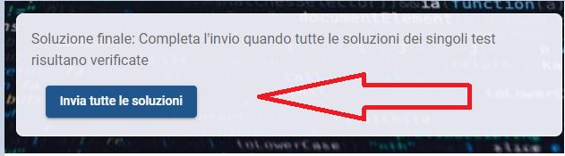

---------------------------------------------
---------------------------------------------

**Benvenuto!** In questa repository troverai i templates relativi ai linguaggi che potrai scegliere per risolvere la challenge.

---
## FASE 1. SCRITTURA DEL CODICE

_Da dove inizio?_

Devi iniziare eseguendo la `fork` di questa repository sul tuo account:

In ogni directory troverai il main relativo di ogni linguaggio, da lì puoi cominciare a scrivere il tuo codice.

Una volta eseguito il fork di questa repository sul tuo account devi fare la `pull` sul tuo pc, adesso puoi iniziare a scrivere il tuo codice. 

Recati all'indirizzo https://codekombat-api.plansoft.it ed effettua il login alla piattaforma tramite le credenziale fornite nell'email inviata il giorno dell'evento:

---
## FASE 2. DATI DA UTILIZZARE 

---

_Ok, ma adesso quali sono i dati che devo utilizzare? Come faccio la richiesta dei test cases da utilizzare?_

Una volta eseguito l'accesso ti troverai davanti alla homepage:

A questo punto bisognerà scegliere l'identificativo del test case da risolvere tramite il menù a tendina in alto:

Selezionando i diversi identificativi riceverai le informazioni associate ad ognuno dei casi. A questo punto utlizza queste informazioni per scrivere il tuo algoritmo in modo da risolvere la challenge.

---

## FASE 3. CHECK SOLUZIONI

---

_Voglio testare se l'argoritmo è corretto, come faccio?_

Nel quadrante verifica soluzioni (in alto a destra) inserisci per ogni test case la sequenza di identificativi dei voli che compongono la soluzione. Sarà sufficiente premere il pulsante "Verifica" per validare la soluzione, in caso sia corretta la checkbox verrà spuntata.

---

---

## FASE 4. SUBMIT SOLUZIONI

_Sono sicuro che il mio algoritmo è perfetto, infatti tutte le soluzioni del check sono corrette, adesso che faccio?_

Sarà sufficiente premere il pulstante "Invia tutte le soluzioni".

## FASE 5. PUSH DEL CODICE - FASE FINALE

L'ultima cosa che ti rimane prima di aver terminato è il caricamento del codice sulla tua repository GitLab. Per fare ciò ti ricordo i tre comandi 

Quando hai finito e devi caricare tutto sulla repository esegui questi tre comandi: 

- `git add`    ---> per aggiungere tutti i file da caricare nella repository.

- `git commit` ---> per preparare tutti i file ad essere caricati.

- `git push`   ---> per caricare effettivamente i file nella repository.

**:warning: Avrai massimo 15 minuti di tempo dal momento che il submit delle soluzioni è corretto per caricare il tuo codice.
Pena la squalifica dalla competizione.:warning:**

---------------------------------------------------------------
---
